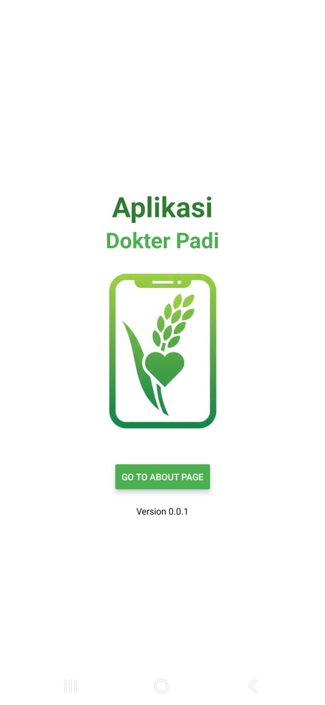
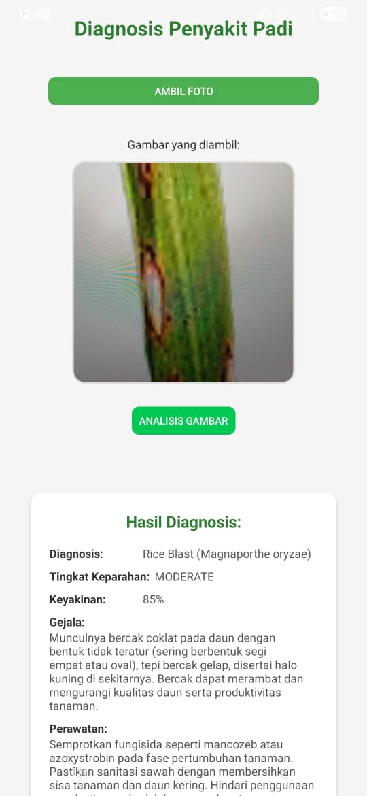
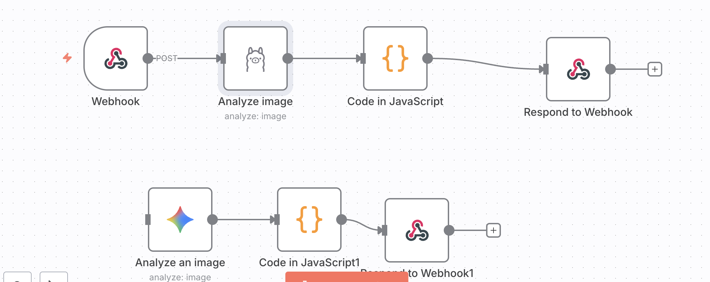

# 🚀 Dokter Padi

Sebuah aplikasi mobile untuk mendeteksi penyakit pada tanaman padi menggunakan AI.
<p align="center">
  
  
</p>

## 📝 Deskripsi

**Dokter Padi** adalah aplikasi mobile yang dikembangkan untuk membantu petani atau pengguna mengidentifikasi penyakit padi secara cepat dan mudah. Aplikasi ini dibuat menggunakan **React Native (Expo Go)**.

Pengguna dapat mengambil gambar daun padi melalui aplikasi, yang kemudian akan dikirim ke backend **n8n (self-hosted)**. Alur kerja n8n akan memproses gambar ini menggunakan model AI (seperti **Gemini 2.5 flash-lite** atau **Qwen3-VL:8b**) untuk menganalisis dan mengidentifikasi potensi penyakit, lalu mengirimkan hasilnya kembali ke aplikasi.

## ✨ Fitur-Fitur Utama

* **Deteksi Penyakit via Gambar:** Ambil foto atau pilih dari galeri untuk menganalisis penyakit padi.
* **Integrasi Model AI:** Terhubung ke workflow n8n yang menjalankan model AI canggih untuk analisis.
* **Respon Cepat:** Memberikan hasil deteksi langsung di aplikasi.
* **Sederhana dan Ringan:** Dibangun dengan Expo Go untuk kemudahan pengembangan dan testing.

## 🔧 Teknologi yang Digunakan

* **Frontend:** React Native (Expo Go)
* **Backend & Orchestration:** n8n (Self-hosted)
* **Model AI/ML:** Gemini 2.5 flash-lite / Qwen3-VL:8b

## 🛠️ Instalasi dan Penyiapan

### 1. Backend (n8n)

1.  Pastikan instance **n8n self-hosted** Anda sudah berjalan dan dapat diakses.
2.  Impor dan aktifkan workflow n8n yang telah Anda buat untuk menerima gambar dan memprosesnya dengan model AI.
3.  Dapatkan URL Webhook dari *trigger node* (node pemicu) di n8n Anda.
   Berikut adalah gambaran umum alur kerja aplikasi:


### 2. Frontend (React Native - Expo Go)

1.  **Clone repositori:**
    ```bash
    git clone [URL-repositori-anda]
    cd [nama-folder-proyek]
    ```
2.  **Install dependencies:**
    ```bash
    npm install
    ```
3.  **Konfigurasi Endpoint n8n:**
    * Buka file konfigurasi di dalam proyek (misalnya `config.js` atau langsung di *service* API Anda).
    * Masukkan URL Webhook n8n yang Anda dapatkan dari langkah 1.
4.  **Jalankan Aplikasi:**
    ```bash
    npx expo start
    ```
5.  Pindai QR code menggunakan aplikasi Expo Go di ponsel Anda.

## Usage (Cara Menggunakan)

1.  Buka aplikasi di ponsel Anda melalui Expo Go.
2.  Di halaman utama, tekan tombol "Ambil Gambar" untuk menggunakan kamera atau "Pilih dari Galeri".
3.  Setelah gambar dipilih, aplikasi akan mengirimkannya ke n8n untuk dianalisis.
4.  Tunggu beberapa saat, dan hasil deteksi penyakit akan ditampilkan di layar.

